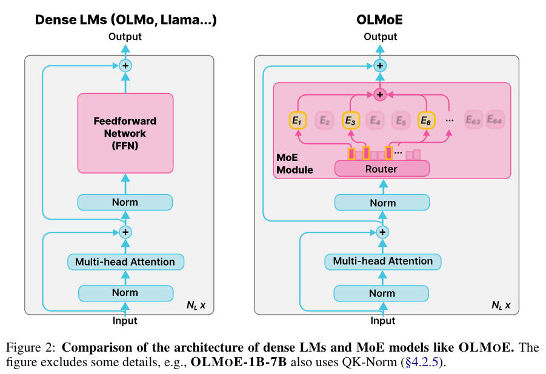

# Hallucination Detection in Mixture-of-Experts Models
## Leveraging Internal Signals for Uncertainty Estimation

João Fonseca

---

## Motivation

### The Hallucination Problem

- Large Language Models (LLMs) can generate plausible but **factually incorrect** information
- Critical issue for real-world applications (healthcare, legal, education)
- Traditional metrics (ROUGE, BLEU) don't capture factuality
- **Challenge**: Can we detect hallucinations without external verification?

---

## Research Question

> To what extent do internal signals from Mixture-of-Experts (MoE) models provide reliable uncertainty estimates for hallucination detection?

### Key Hypotheses

1. **Expert routing patterns** differ systematically between factual and hallucinated content
2. **Hidden state dynamics** correlate with generation uncertainty
3. **Signal combinations** outperform individual metrics for hallucination prediction

---

## Mixture-of-Experts Architecture

### Why MoE Models?

<div style="display: flex; gap: 2rem;">
<div>

- **Sparse activation**: Only subset of experts active per token
- **Routing decisions**: Model chooses experts dynamically
- **Rich internal signals**: More observable states than dense models

</div>
<div>



*Dense LMs vs. OLMoE: Router selects top-k experts per token*

</div>
</div>

### OLMoE-1B-7B Model

- 1B active parameters per token
- 7B total parameters
- 64 experts per MoE layer
- Top-8 routing (8 experts selected per token)

---

## Dataset: RealtimeQA

### Characteristics

- Questions about **recent events**
- Time-sensitive answers
- Perfect for hallucination study:
  - **Without evidence**: High hallucination risk
  - **With evidence (RAG)**: Should be grounded
    - This, however, is not guaranteed - models can still hallucinate

### Example #1: In which country did the first Winter Olympics take place in 1924? (no evidence provided, not hallucination)

Evidence: The very first Winter Olympics were held in the French ski resort of Chamonix.

Answer: The first Winter Olympics took place in Chamonix, France, in 1924. These Olympic Games were the first international winter sports competitions and marked the beginning of the Winter Olympic Games as we know them today.

### Example #2: Tyler Reddick recently won NASCAR's "Great American Race", held annually in which state? (no evidence provided, hallucination)

Evidence: Reddick won the Daytona 500, held every February in Daytona Beach, Florida. The driver notched a victory for the racing team owned by basketball legend Michael Jordan.

Answer: Tyler Reddick, an American NASCAR driver, won the 2022 NASCAR Cup Series Great American Race, which is held annually in the state of Texas. The race, also known as the Daytona 500, is the season-opening NASCAR race and takes place at the Daytona International Speedway in Dayton.

### Example #3: The current Lunar New Year celebration is marked by which animal in the Chinese zodiac calendar? (evidence provided, not hallucination)

Evidence: The world rang in the Year of the Horse on February 17 — the first day of the Lunar New Year festivities.

Answer: The current Lunar New Year celebration, also known as the Year of the Horse, is marked by the presence of the horse in the Chinese zodiac calendar. This year, 2026 is the Year of the Horse.

### Example #4: American Edward Eagan is the only person to win a gold medal in both the Summer and Winter Olympics. He won in the four-man bobsled in 1932, but in which sport did he win his Summer gold medal in 1920? (evidence provided, hallucination)

Evidence: The answer is boxing. Other athletes have competed in both Games, but no one else has won a gold medal in both.

Answer: American Edward Eagan won his Summer Olympic gold medal in 1920, competing in the 1920 Summer Olympics in the 50-meter rifle event. He finished with a score of 1,079 points, earning the gold medal.


---

## Pipeline Overview

### Five-Stage Approach

1. **Answer Generation**
   - Base generation (no evidence)
   - "RAG" generation (with evidence)
   - Capture internal signals (logits, hidden states, expert routing)

2. **Metric Analysis** 
   - ROUGE, BERTScore, BLEU
   - Separability analysis
   - Shows decent separation but not perfect

3. **Label Creation**
   - Weak labels from metrics
   - LLM-based labels (Ollama)
   - Token-level spans

4. **Detection Model** 
   - Train on combined signals
   - Evaluate performance

5. **Evaluation & Analysis**
   - Include human evaluation if possible
   - (TBD)

---

## Internal Signals Captured

### 1. Hidden States
- Magnitude and variance across layers
- Shape: `(batch, sequence, layers, hidden_size)`
- Hypothesis: Higher variance = uncertainty

### 2. Expert Routing
- **Expert indices**: Which experts are selected
- **Expert weights**: Confidence in routing decisions
- **Router entropy**: Uncertainty in expert selection

### 3. Expert-Level Features
- Hidden state similarity between experts
- Expert usage frequency
- Cross-expert variance

### 4. Attention Weights
- Multi-head attention patterns
- Entropy of attention distributions
- Hypothesis: Diffuse attention = uncertainty

---

## Uncertainty Metrics

### Overview

```python
# From model internals
hidden_scores = hidden_score(hidden_states)
attention_scores = attention_score(attention_weights)
scores_entropy = topk_entropy(logits)
router_entropy = topk_entropy(expert_weights)

# From expert behavior
expert_hidden_scores = expert_hidden_score(expert_hiddens, weights)
expert_similarities = expert_similarity(expert_hiddens, weights)
expert_usage = count_expert_usage(expert_indices)
```

### Metrics Summary

| Metric | Description | Shape |
|--------|-------------|-------|
| `hidden_scores` | SVD-based hidden state uncertainty | (B, T, L) |
| `attention_scores` | Attention weight magnitude & variance | (B, L, H, T) |
| `scores_entropy` | Entropy over top-k logits | (B, T) |
| `router_entropy` | Entropy over expert routing weights | (B, T, L) |
| `expert_hidden_score` | Weighted expert hidden uncertainty | (B, T, L) |
| `expert_similarities` | Inter-expert agreement score | (B, T, L) |
| `expert_usage` | Expert selection frequency | (B, L, E) |

*B=batch, T=sequence, L=layers, H=heads, E=num experts*

### 1. Hidden Scores

**SVD-based uncertainty from hidden state covariance**

Given hidden states $H \in \mathbb{R}^{B \times T \times L \times d}$:

$$C_{btl} = H_{btl} H_{btl}^T \in \mathbb{R}^{d \times d}$$

$$\sigma_1, \sigma_2, \ldots, \sigma_d = \text{SVD}(C_{btl})$$

$$s_{btl} = \frac{2}{d} \sum_{i=1}^{d} \log(\sigma_i)$$

Higher values indicate more structured/confident representations.

### 2. Attention Scores

**Cumulative log-diagonal of attention weights**

Given attention weights $A \in \mathbb{R}^{B \times L \times H \times T \times T}$:

$$A_{\text{diag}} = \text{diag}(A) \in \mathbb{R}^{B \times L \times H \times T}$$

$$s_{blht} = \sum_{i=1}^{t} \log(A_{\text{diag}, blhi})$$

Output shape: (B, L, H, T)

### 3. Scores Entropy

**Shannon entropy over top-k predicted tokens**

Given logits $z \in \mathbb{R}^{V}$:

$$p = \text{softmax}(z) = \frac{e^{z_i}}{\sum_{j=1}^{V} e^{z_j}}$$

$$p_{\text{top-k}} = \text{top-k}(p, k)$$

$$H(p_{\text{top-k}}) = -\sum_{i=1}^{k} p_i \log(p_i)$$

Higher entropy indicates uncertainty in token prediction.

### 4. Router Entropy

**Shannon entropy over expert routing weights**

Given routing weights $w \in \mathbb{R}^{E}$ for selected experts:

$$\bar{w} = \frac{w}{\sum_{i=1}^{k} w_i}$$

$$H(\bar{w}) = -\sum_{i=1}^{k} \bar{w}_i \log(\bar{w}_i)$$

Higher entropy indicates uncertain expert selection (k=8 for OLMoE).

### 5. Expert Hidden Scores

**Weighted combination of per-expert hidden scores**

Given expert hidden states $H_e \in \mathbb{R}^{k \times d}$ and weights $w$:

$$s_i = \text{hidden\_score}(H_{e_i}) \quad \text{for } i=1,\ldots,k$$

$$\bar{w} = \frac{w}{\sum_{j=1}^{k} w_j}$$

$$s_{\text{expert}} = \sum_{i=1}^{k} \bar{w}_i s_i$$

Aggregates uncertainty across selected experts.

### 6. Expert Similarities

**Weighted pairwise similarity between expert outputs**

Given expert hidden states $H_e$ and normalized weights $\bar{w}$:

$$S_{ij} = \frac{H_{e_i} \cdot H_{e_j}}{\|H_{e_i}\| \|H_{e_j}\|}$$

$$W = \bar{w} \bar{w}^T \in \mathbb{R}^{k \times k}$$

$$s_{\text{sim}} = \sum_{i=1}^{k} \sum_{j=1}^{k} W_{ij} S_{ij} = \text{tr}(W^T S)$$

Higher values = experts agree more (lower uncertainty).

### 7. Expert Usage

**Frequency of expert selection across sequence**

Given expert indices $I \in \mathbb{Z}^{B \times T \times L \times k}$:

$$U_{ble} = \sum_{t=1}^{T} \sum_{j=1}^{k} \mathbb{1}[I_{btlj} = e]$$

$$U \in \mathbb{Z}^{B \times L \times E}$$

Counts how many times each expert is used per layer, per sample.

---

## Evaluation Metrics

### ROUGE-L

**Longest Common Subsequence F-score**

Given candidate $X$ and reference $Y$:

$$\text{LCS}(X, Y) = \text{longest common subsequence}$$

$$R_L = \frac{\text{LCS}(X, Y)}{|Y|}, \quad P_L = \frac{\text{LCS}(X, Y)}{|X|}$$

$$F_L = \frac{(1 + \beta^2) R_L P_L}{R_L + \beta^2 P_L}$$

where $\beta = 1.2$ (favors recall)

### BLEU

**Modified n-gram precision with brevity penalty**

Given n-gram precision scores:

$$p_n = \frac{\sum_{\text{n-gram} \in X} \min(\text{count}_X, \text{count}_Y)}{\sum_{\text{n-gram} \in X} \text{count}_X}$$

$$BP = \begin{cases} 
1 & \text{if } |X| > |Y| \\
e^{1 - |Y|/|X|} & \text{otherwise}
\end{cases}$$

$$\text{BLEU} = BP \cdot \exp\left(\sum_{n=1}^{4} \frac{1}{4} \log p_n\right)$$

### Optimal Threshold Selection

**Youden's J statistic for ROC-optimal threshold**

Given ROC curve with true positive rate (TPR) and false positive rate (FPR):

$$J(\tau) = \text{TPR}(\tau) - \text{FPR}(\tau)$$

$$\tau^* = \arg\max_{\tau} J(\tau)$$

Equivalently maximizes balanced accuracy:

$$\text{Accuracy}(\tau) = \frac{\text{TPR}(\tau) + \text{TNR}(\tau)}{2}$$

where TNR = 1 - FPR (true negative rate)

---

## Label Generation Strategy

### Multi-Source Labeling

1. **Weak Labels** (always available)
   - Evidence presence (binary)
   - Metric threshold flags
   - Combined hallucination score

2. **LLM Labels** (optional, expensive)
   - Ollama API calls
   - Binary classification
   - Hallucinated span extraction

3. **Logistic Regression Classifier**
   - Trained on LLM labels
   - Applied to full dataset
   - Output: hallucination confidence

---

## Answer-Level Labels

### Features Used

- Evidence presence
- ROUGE-1, ROUGE-2, ROUGE-L, ROUGE-Lsum
- BERTScore (precision, recall, F1)
- BLEU score

### Weak Hallucination Score

```python
weak_score = (
    evidence_flag +
    sum(metric_flags) / num_metrics
) / 2
```

### LLM-Enhanced Labels

- Parallel API calls (multi-threading)
- JSON-formatted responses
- Fallback to weak labels if unavailable

---

## Token-Level Labels

### Two Approaches

1. **LLM Span Extraction**
   - Prompt: Identify hallucinated substrings
   - Map spans to token masks
   - JSON parsing with regex fallback

2. **Heuristic Lexical Support**
   - Tokens in evidence/reference = grounded
   - Tokens not in support = hallucinated
   - Stopwords always grounded

### Output

- `label_token_hallucination_mask`: Binary mask per token
- `label_token_hallucination_ratio`: Proportion hallucinated

---

## Cost Optimization

### LLM Labeling is Expensive

**Original approach**: 2N API calls
- N calls for answer-level labels
- N calls for token-level spans

**Optimized approach**: N API calls (50% reduction)
- Single prompt returns both
- JSON schema: `{"label": bool, "hallucinated_spans": [...]}`

### Parallelization

- ThreadPoolExecutor with all CPU cores
- Progress tracking with tqdm
- ~10x speedup on multi-core machines

---

## Migration to Ollama

### Why Ollama?

**Cost comparison** (4000 questions, 2 variants = 8000 calls):

| Model | Input Cost | Output Cost | Total Estimate |
|-------|-----------|-------------|----------------|
| Claude Opus 4.6 | $6.15/M | $30.75/M | ~$50-150 |
| GLM-5 | $0.80/M | $2.56/M | ~$12-15 |
| **Ollama (local)** | **$0** | **$0** | **FREE** |

### Trade-offs

- **Cost**: Free for self-hosted
- **Speed**: Slower than cloud (parallelization helps)
- **Quality**: Depends on model (Gemma, Llama, etc.)

---

## Code Architecture

### Modular Design

```
moeuncert/
├── datasets.py          # RealtimeQA loading
├── forwards/            # Custom forward passes
├── monitoring/          # LLMMonitor wrapper
├── metrics/             # Uncertainty metrics
├── experiments/         # Shared utilities
│   ├── paths.py        # Path resolution
│   └── utils.py        # Optimal thresholds
└── utils.py             # Generation helpers
```

### Design Principles

- **DRY**: Shared utilities (resolve_model_slug, etc.)
- **CLI-first**: All scripts have argparse
- **Reproducible**: Fixed seeds, saved outputs
- **Incremental**: Each step builds on previous

---

## Experiment Scripts

### 1.0-generate-answers.py

```bash
python experiments/1.0-generate-answers.py \
  --model allenai/OLMoE-1B-7B-0924-Instruct \
  --years 2026 --month 2
```

**Outputs**:
- `results.parquet`: Answers + metrics
- `base_generation/*.pt`: Model internals (no evidence)
- `evidence_generation/*.pt`: Model internals (with evidence)

---

## Experiment Scripts

### 1.1-analyze-metrics.py

```bash
python experiments/1.1-analyze-metrics.py \
  --model allenai/OLMoE-1B-7B-0924-Instruct \
  --years 2026 --month 2
```

**Outputs** (in `figures/`):
- `metrics_violin_plot.png`: Distribution comparisons
- `roc_curves.png`: ROC curves per metric + combined
- `confusion_matrices.png`: Performance at optimal thresholds

---

## Experiment Scripts

### 2.0-make-labels.py

```bash
python experiments/2.0-make-labels.py \
  --model allenai/OLMoE-1B-7B-0924-Instruct \
  --years 2026 --month 2 \
  --ollama-model gemma3-1b \
  --max-llm-answer-samples 100
```

**Outputs**:
- `results_labeled_{ollama_model}.parquet`: With hallucination labels

---

## Preliminary Results

### Metric Separability (Feb 2026 data, N=45)

- **ROUGE-L**: Moderate separation, AUC ~0.7
- **BERTScore F1**: Poor separation (values all >0.95)
- **Logistic Regression**: Best performance, AUC ~0.8
- **Evidence presence**: Strongest single feature

### Observations

- Metrics alone insufficient
- **Combination crucial** for detection
- MoE signals (expert routing, etc.) needed for next stage

---

## Current Limitations

### Technical Challenges

1. **Batch dimension loss** in forward passes
   - Hidden states flattened, not reshaped
   - Prevents per-sample analysis
   - Needs fix in `moeuncert/forwards/_model_forwards.py`

2. **Small dataset**: Only ~45 samples per month
   - Need larger evaluation set
   - Multi-month aggregation planned

3. **No token-level evaluation** yet
   - Metrics for span quality needed
   - Human evaluation desirable

---

## Future Work

### Near-Term

1. **Fix batch processing** bug
2. **Complete detection model** training (3.0-detection-model-training.py)
3. **Evaluate on larger dataset** (multiple months)
4. **Compare baselines**: FacLens, SelfCheckGPT

### Long-Term

1. **Multi-dataset evaluation**: TruthfulQA, FreshQA, HotpotQA
2. **Real-time deployment**: API for hallucination scoring
3. **Interpretability**: Which experts/layers matter most?
4. **Adaptive routing**: Use uncertainty to trigger retrieval

---

## Key Contributions

### Research Contributions

1. **Novel signal extraction** from MoE internals
2. **Cost-efficient labeling** pipeline with Ollama
3. **Multi-level labels**: Answer + token granularity
4. **Reproducible pipeline** with open-source tools

### Engineering Contributions

1. **Modular codebase** with shared utilities
2. **Efficient parallelization** for API calls
3. **Flexible CLI** for experimentation
4. **Comprehensive documentation**

---

## Technical Insights

### What Worked

✅ Ollama integration (cost savings)  
✅ Parallel API calls (10x speedup)  
✅ Code consolidation (DRY principles)  
✅ Incremental pipeline design  

### What Didn't Work

❌ BERTScore (not discriminative enough)  
❌ Sequential processing (too slow)  
❌ Cloud APIs (too expensive for iteration)  

---

## Lessons Learned

### Research

- **Metrics matter**: Choose wisely, validate separability
- **Labels are expensive**: Multi-source strategy essential
- **Domain matters**: RealtimeQA perfect for hallucination study

### Engineering

- **Profile before optimizing**: Parallel calls had huge impact
- **DRY saves time**: Consolidated utilities avoided bugs
- **CLI flexibility**: Enable rapid experimentation
- **Document early**: Saves debugging time

---

## Reproducibility

### Open Research

- **Code**: All scripts available
- **Data**: RealtimeQA publicly accessible
- **Models**: OLMoE-1B-7B on HuggingFace
- **Dependencies**: `requirements.txt` with versions

### Running the Pipeline

```bash
# Install dependencies
pip install -r requirements.txt

# Run full pipeline
python experiments/1.0-generate-answers.py --years 2026 --month 2
python experiments/1.1-analyze-metrics.py --years 2026 --month 2
python experiments/2.0-make-labels.py --years 2026 --month 2 \
  --ollama-model gemma3-1b
```

---

## Conclusion

### Main Findings

1. **Internal MoE signals** show promise for hallucination detection
2. **Metric combination** outperforms individual features
3. **Cost-efficient labeling** is achievable with Ollama
4. **Multi-level supervision** (answer + token) is feasible

### Next Steps

1. Fix batch processing for full MoE signal extraction
2. Complete detection model training and evaluation
3. Scale to larger datasets and multiple domains
4. Compare against state-of-the-art baselines

---

## Thank You!

### Questions?

**Contact**: João Fonseca  
**Code**: [GitHub Repository]  
**Dataset**: RealtimeQA (github.com/realtimeqa/realtimeqa_public)  
**Model**: OLMoE-1B-7B (HuggingFace)

---

## Appendix: Metric Definitions

### ROUGE (Recall-Oriented Understudy for Gisting Evaluation)

- ROUGE-1: Unigram overlap
- ROUGE-2: Bigram overlap  
- ROUGE-L: Longest common subsequence
- ROUGE-Lsum: Summary-level LCS

### BERTScore

- Uses BERT embeddings for semantic similarity
- Precision, Recall, F1 variants
- Context-aware (unlike ROUGE/BLEU)

### BLEU (Bilingual Evaluation Understudy)

- N-gram precision with brevity penalty
- Originally for machine translation

---

## Appendix: Implementation Details

### Model Monitoring

```python
from moeuncert.monitoring import MoEMonitor

monitor = MoEMonitor(
    model=model,
    tokenizer=tokenizer,
    output_router_logits=True
)

outputs = monitor.generate(
    **inputs,
    max_new_tokens=128
)

# Access internal signals
hidden_states = outputs["hidden_states"]
expert_idx = outputs["expert_idx"]
expert_weights = outputs["expert_weights"]
```

---

## Appendix: Compute Requirements

### Hardware Used

- **GPU**: CUDA-capable (for model inference)
- **CPU**: Multi-core for parallel API calls
- **RAM**: ~16GB for model loading
- **Storage**: ~10GB for model + data

### Runtime (45 samples)

- Answer generation: ~5 min (batch_size=6)
- Metric analysis: <1 min
- Label creation (with LLM): ~10-30 min
  - Depends on Ollama model size
  - Parallelized across CPU cores

---

## Appendix: Directory Structure

```
MoE-Uncertainty-Estimation/
├── experiments/          # Numbered scripts
│   ├── 0.X-*.py         # Exploration
│   ├── 1.X-*.py         # Generation & analysis
│   ├── 2.0-make-labels.py
│   └── 3.0-detection-model-training.py
├── moeuncert/           # Package code
│   ├── datasets.py
│   ├── forwards/
│   ├── metrics/
│   ├── monitoring/
│   └── experiments/
├── data/                # Generated data
│   └── realtimeqa-YYYY-MM/
│       └── model_slug/
├── figures/             # Visualizations
└── requirements.txt
```
